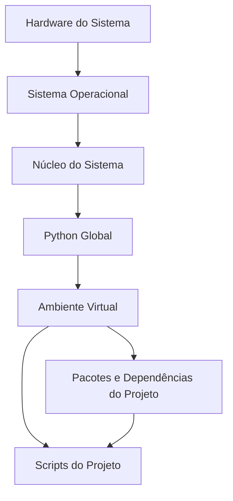

# Minha Evolução no Web Scraping

## 1. Identificação das Classes Mais Usadas na Página

**Objetivo:** Analisar a estrutura da página para identificar as classes CSS mais frequentemente utilizadas, o que facilita a extração de dados específicos.

**Ferramentas Utilizadas:** `BeautifulSoup`, `requests`, `collections.Counter`.

**Resultado:** O terminal retorna as classes mais comuns na página, permitindo a identificação de padrões estruturais. Isso auxilia na criação de seletores eficientes para o web scraping.

**[Acesse o código aqui](./class_identifier.py)**

## 2. Uso de Proxy e Tor para Anonimização

**Objetivo:** Implementar o uso do Tor para rotacionar IPs automaticamente, evitando bloqueios durante a coleta massiva de dados.

**Ferramentas Utilizadas:** `requests`, `stem`, `Tor`.

**Resultado:** Através da integração com o Tor, o IP é rotacionado dinamicamente, permitindo a coleta de dados sem bloqueios e aumentando a resiliência contra mecanismos anti-scraping.

**[Acesse o código aqui](./tor_scraper.py)**

## 3. Web Scraping Automatizado com Selenium

**Objetivo:** Implementar uma rotina automatizada de coleta de dados usando Selenium, capaz de navegar por várias páginas e coletar todas as 145 questões necessárias.

**Ferramentas Utilizadas:** `Selenium WebDriver`, `webdriver_manager`, `ChromeDriver`, `Selenium Options`.

**Resultado:** A coleta automatizada foi realizada com sucesso, atingindo o objetivo de 145 questões. O uso de Selenium permitiu uma navegação eficiente e a extração precisa das informações desejadas.

**[Acesse o código aqui](./selenium_scraper.py)**

## 4. Uso de Ambiente Virtual no Terminal

**Objetivo:** Criar um ambiente isolado para garantir que todas as dependências necessárias para os scripts sejam gerenciadas de forma independente, evitando conflitos com outras bibliotecas instaladas no sistema.

**Resultado:** O uso de um ambiente virtual garantiu que as versões das bibliotecas utilizadas nos scripts fossem consistentes e isoladas do ambiente global do sistema.

### Explicação sobre o Uso de Ambiente Virtual

**Ambientes virtuais** são utilizados em Python para criar um ambiente isolado onde você pode instalar pacotes e bibliotecas específicas para um projeto, sem interferir com outras bibliotecas instaladas globalmente no sistema. Isso é especialmente útil para gerenciar diferentes versões de pacotes e evitar conflitos entre dependências em projetos diferentes.

**Como funciona:**

1. **Criação do Ambiente Virtual:** Um ambiente virtual cria uma cópia isolada do interpretador Python e de todas as ferramentas necessárias para executar um projeto. Isso significa que você pode instalar pacotes específicos para esse ambiente sem afetar outros projetos ou o sistema.
    
2. **Ativação do Ambiente Virtual:** Quando você ativa um ambiente virtual, o terminal passa a usar os pacotes e bibliotecas instalados nesse ambiente específico, em vez de usar os pacotes globais do sistema.
    
4. **Desativação do Ambiente Virtual:** Quando você termina de trabalhar em um projeto, você pode desativar o ambiente virtual e voltar ao ambiente global do sistema.



**Passos para usar um ambiente virtual:**

- **Criar o ambiente virtual:**

```bash
python3 -m venv myenv
```

- **Ativar o ambiente virtual:**

```bash
source myenv/bin/activate
```

- **Instalar as dependências necessárias dentro do ambiente virtual:**

```bash
pip install -r requirements.txt
```

- **Desativar o ambiente virtual:**

```bash
deactivate
```

